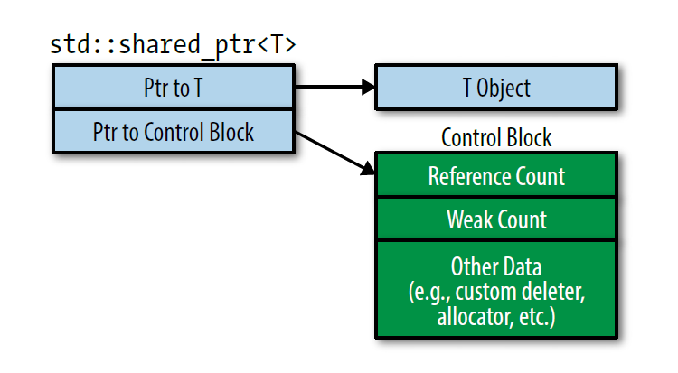
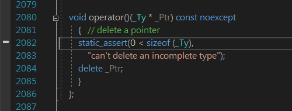

* 原始指针的缺陷有：
  * 声明中未指出指向的是单个对象还是一个数组
  * 没有提示使用完对象后是否需要析构，从声明中无法看出指针是否拥有对象
  * 不知道析构该使用 delete 还是其他方式（比如传入一个专门用于析构的函数）
  * 即使知道了使用 delete，也不知道 delete 的是单个对象还是数组（使用 delete[]）
  * 难以保证所有路径上只产生一次析构
  * 没有检查空悬指针的办法
* 智能指针解决了这些问题，它封装了原始指针，行为看起来和原始指针类似但大大减少了犯错的可能
* C++17 中有三种智能指针：[std::shared_ptr](https://en.cppreference.com/w/cpp/memory/shared_ptr)、[std::unique_ptr](https://en.cppreference.com/w/cpp/memory/unique_ptr)、[std::weak_ptr](https://en.cppreference.com/w/cpp/memory/weak_ptr)

## 18 用[std::unique_ptr](https://en.cppreference.com/w/cpp/memory/unique_ptr)管理所有权唯一的资源
* 使用智能指针时一般首选[std::unique_ptr](https://en.cppreference.com/w/cpp/memory/unique_ptr)，默认情况下它和原始指针尺寸相同
* [std::unique_ptr](https://en.cppreference.com/w/cpp/memory/unique_ptr)对资源拥有唯一所有权，因此它是move-obly类型，不允许拷贝。它常用作工厂函数的返回类型，这样工厂函数生成的对象在需要销毁时会被自动析构，而不需要手动析构
```cpp
class A {};

std::unique_ptr<A> makeA()
{
    return std::unique_ptr<A>(new A);
}

auto p = makeA();
```
* [std::unique_ptr](https://en.cppreference.com/w/cpp/memory/unique_ptr)的析构默认通过 delete 内部的原始指针完成，但也可以自定义删除器，删除器需要一个[std::unique_ptr](https://en.cppreference.com/w/cpp/memory/unique_ptr)内部指针类型的参数
```cpp
class A {};

auto f = [](A* p) { std::cout << "destroy\n"; delete p; };

std::unique_ptr<A, decltype(del)> makeA()
{
    std::unique_ptr<A, decltype(f)> p(new A, f);
    return p;
}
```
* 使用 C++14 的 auto 返回类型，可以将删除器的 lambda 定义在工厂函数内，封装性更好一些
```cpp
class A {};

auto makeA()
{
    auto f = [](A* p) { std::cout << "destroy\n"; delete p; };
    std::unique_ptr<A, decltype(f)> p(new A, f);
    return p;
}
```
* 可以进一步扩展成支持继承体系的工厂函数
```cpp
class A {
public:
    virtual ~A() {} // 删除器对任何对象调用的是基类的析构函数，因此必须声明为虚函数
};
class B : public A {}; // 基类的析构函数为虚函数，则派生类的析构函数默认为虚函数
class C : public A {};
class D : public A {};

auto makeA(int i)
{
    auto f = [](A* p) { std::cout << "destroy\n"; delete p; };
    std::unique_ptr<A, decltype(f)> p(nullptr, f);
    if(i == 1) p.reset(new B);
    else if(i == 2) p.reset(new C);
    else p.reset(new D);
    return p;
}
```
* 默认情况下，[std::unique_ptr](https://en.cppreference.com/w/cpp/memory/unique_ptr)和原始指针尺寸相同，如果自定义删除器则[std::unique_ptr](https://en.cppreference.com/w/cpp/memory/unique_ptr)会加上删除器的尺寸。一般无状态的函数对象（如无捕获的 lambda）不会浪费任何内存，作为删除器可以节约空间
```cpp
class A{};

auto f = [](A* p) { delete p; };
void g(A* p) { delete p; }
struct X {
    void operator()(A* p) const { delete p; }
};

std::unique_ptr<A> p1(new A);
std::unique_ptr<A, decltype(f)> p2(new A, f);
std::unique_ptr<A, decltype(g)*> p3(new A, g);
std::unique_ptr<A, decltype(X())> p4(new A, X());

// 机器为64位
std::cout << sizeof(p1) // 8：默认尺寸，即一个原始指针的尺寸
    << sizeof(p2) // 8：无捕获lambda不会浪费尺寸
    << sizeof(p3) // 16：函数指针占一个原始指针尺寸
    << sizeof(p4); // 8：无状态的函数对象。但如果X中存储了状态（如数据成员、虚函数）就会增加尺寸
```
* [std::unique_ptr](https://en.cppreference.com/w/cpp/memory/unique_ptr)作为返回类型的另一个方便之处是，可以转为[std::shared_ptr](https://en.cppreference.com/w/cpp/memory/shared_ptr)
```cpp
// std::make_unique的返回类型是std::unique_ptr
std::shared_ptr<int> p = std::make_unique<int>(42); // OK
```
* [std::unique_ptr](https://en.cppreference.com/w/cpp/memory/unique_ptr)针对数组提供了一个特化版本，此版本提供[operator[]](https://en.cppreference.com/w/cpp/memory/unique_ptr/operator_at)，但不提供[单元素版本的operator\*和operator-\>](https://en.cppreference.com/w/cpp/memory/unique_ptr/operator*)，这样对其指向的对象就不存在二义性
```cpp
std::unique_ptr<int[]> p(new int[3]{11, 22, 33});
for(int i = 0; i < 3; ++i) std::cout << p[i];
```

## 19 用[std::shared_ptr](https://en.cppreference.com/w/cpp/memory/shared_ptr)管理所有权可共享的资源
* [std::shared_ptr](https://en.cppreference.com/w/cpp/memory/shared_ptr)内部有一个引用计数，用来存储资源被共享的次数。因为内部多了一个指向引用计数的指针，所以[std::shared_ptr](https://en.cppreference.com/w/cpp/memory/shared_ptr)的尺寸是原始指针的两倍
```cpp
int* p = new int(42);
auto q = std::make_shared<int>(42);
std::cout << sizeof(p) << sizeof(q); // 816
```
* [std::shared_ptr](https://en.cppreference.com/w/cpp/memory/shared_ptr)保证线程安全，因此引用计数的递增和递减是原子操作，原子操作一般比非原子操作慢
* [std::shared_ptr](https://en.cppreference.com/w/cpp/memory/shared_ptr)默认析构方式和[std::unique_ptr](https://en.cppreference.com/w/cpp/memory/unique_ptr)一样，也是 delete 内部的原始指针，同样可以自定义删除器，不过不需要在模板参数中指明删除器类型
```cpp
class A {};
auto f = [](A* p) { delete p; };

std::unique_ptr<A, decltype(f)> p(new A, f);
std::shared_ptr<A> q(new A, f);
```
* 模板参数不使用删除器的设计在使用上带来了一些弹性
```cpp
std::shared_ptr<A> p(new A, f);
std::shared_ptr<A> q(new A, g);
// 使用不同的删除器但具有相同的类型，因此可以放进同一容器
std::vector<std::shared_ptr<A>> v{ p, q };
```
* 删除器不影响[std::shared_ptr](https://en.cppreference.com/w/cpp/memory/shared_ptr)的尺寸，因为删除器不是[std::shared_ptr](https://en.cppreference.com/w/cpp/memory/shared_ptr)的一部分，而是位于堆上或自定义分配器的内存位置。[std::shared_ptr](https://en.cppreference.com/w/cpp/memory/shared_ptr)有一个 control block，它包含了引用计数的指针和自定义删除器的拷贝，以及一些其他数据（比如弱引用计数）



* [std::shared_ptr](https://en.cppreference.com/w/cpp/memory/shared_ptr)内部实现如下
```cpp
template<typename T>
struct sp_element {
    using type = T;
};

template<typename T>
struct sp_element<T[]> {
    using type = T;
};


template<typename T, std::size_t N>
struct sp_element<T[N]> {
    using type = T;
};

template<typename T>
class shared_ptr {
    using elem_type = typename sp_element<T>::type
    elem_type* px; // 内部指针
    shared_count pn; // 引用计数
    template<typename U> friend class shared_ptr;
    template<typename U> friend class weak_ptr;
};

class shared_count {
    sp_counted_base* pi;
    int shared_count_id;
    friend class weak_count;
};

class weak_count {
    sp_counted_base* pi;
};

class sp_counted_base {
    int use_count; // 引用计数
    int weak_count; // 弱引用计数
};

template<typename T>
class sp_counted_impl_p: public sp_counted_base {
    T* px; // 删除器
};
```
* control block 在创建第一个[std::shared_ptr](https://en.cppreference.com/w/cpp/memory/shared_ptr)时确定，因此 control block 的创建发生在如下时机
  * 调用[std::make_shared](https://en.cppreference.com/w/cpp/memory/shared_ptr/make_shared)时：调用时生成一个新对象，此时显然不会有关于该对象的 control block
  * 从[std::unique_ptr](https://en.cppreference.com/w/cpp/memory/unique_ptr)构造[std::shared_ptr](https://en.cppreference.com/w/cpp/memory/shared_ptr)时：因为[std::unique_ptr](https://en.cppreference.com/w/cpp/memory/unique_ptr)没有 control block
  * 用原始指针构造[std::shared_ptr](https://en.cppreference.com/w/cpp/memory/shared_ptr)时
* 这意味着用同一个原始指针构造多个[std::shared_ptr](https://en.cppreference.com/w/cpp/memory/shared_ptr)，将创建多个 control block，即有多个引用指针，当引用指针变为零时就会出现多次析构的错误
```cpp
int main()
{
    {
        int* i = new int(42);
        std::shared_ptr<int> p(i);
        std::shared_ptr<int> q(i);
    } // 错误
}
```
* 使用[std::make_shared](https://en.cppreference.com/w/cpp/memory/shared_ptr/make_shared)就不会有这个问题
```cpp
auto p = std::make_shared<int>(42);
```
* 但[std::make_shared](https://en.cppreference.com/w/cpp/memory/shared_ptr/make_shared)不支持自定义删除器，这时应该直接传递 new 的结果
```cpp
auto f = [](int*) {};
std::shared_ptr<int> p(new int(42), f);
```
* 用类的 this 指针构造[std::make_shared](https://en.cppreference.com/w/cpp/memory/shared_ptr/make_shared)时，\*this 的所有权不会被共享
```cpp
class A {
public:
    std::shared_ptr<A> f() { return std::shared_ptr<A>(this); }
};

auto p = std::make_shared<A>();
auto q = p->f();
std::cout << p.use_count() << q.use_count(); // 11
```
* 为了解决这个问题，需要继承[std::enable_shared_from_this](https://en.cppreference.com/w/cpp/memory/enable_shared_from_this)，通过其提供的[shared_from_this](https://en.cppreference.com/w/cpp/memory/enable_shared_from_this/shared_from_this)获取 \*this 的所有权
```cpp
class A : public std::enable_shared_from_this<A> {
public:
    std::shared_ptr<A> f() { return shared_from_this(); }
};

auto p = std::make_shared<A>();
auto q = p->f();
std::cout << p.use_count() << q.use_count(); // 22
```
* [shared_from_this](https://en.cppreference.com/w/cpp/memory/enable_shared_from_this/shared_from_this)的原理是为 \*this 的 control block 创建一个新的[std::shared_ptr](https://en.cppreference.com/w/cpp/memory/shared_ptr)，因此 \*this 必须有一个已关联的 control block，即有一个指向 \*this 的[std::shared_ptr](https://en.cppreference.com/w/cpp/memory/shared_ptr)，否则行为未定义，抛出[std::bad_weak_ptr](https://en.cppreference.com/w/cpp/memory/bad_weak_ptr)异常
```cpp
class A : public std::enable_shared_from_this<A> {
public:
    std::shared_ptr<A> f() { return shared_from_this(); }
};

auto p = new A;
auto q = p->f(); // 抛出std::bad_weak_ptr异常
```
* 为了只允许创建用[std::shared_ptr](https://en.cppreference.com/w/cpp/memory/shared_ptr)指向的对象，可以将构造函数放进 private 作用域，并提供一个返回[std::shared_ptr](https://en.cppreference.com/w/cpp/memory/shared_ptr)对象的工厂函数
```cpp
class A : public std::enable_shared_from_this<A> {
public:
    static std::shared_ptr<A> create() { return std::shared_ptr<A>(new A); }
    std::shared_ptr<A> f() { return shared_from_this(); }
private:
    A() = default;
};

auto p = A::create(); // 构造函数为private，auto p = new A将报错
auto q = p->f(); // OK
```

## 20 用[std::weak_ptr](https://en.cppreference.com/w/cpp/memory/weak_ptr)观测[std::shared_ptr](https://en.cppreference.com/w/cpp/memory/shared_ptr)的内部状态
* [std::weak_ptr](https://en.cppreference.com/w/cpp/memory/weak_ptr)不能解引用，它不是一种独立的智能指针，而是[std::shared_ptr](https://en.cppreference.com/w/cpp/memory/shared_ptr)的一种扩充，它用[std::shared_ptr](https://en.cppreference.com/w/cpp/memory/shared_ptr)初始化，共享对象但不改变引用计数，主要作用是观察[std::shared_ptr](https://en.cppreference.com/w/cpp/memory/shared_ptr)的内部状态
```cpp
std::weak_ptr<int> w;

void f(std::weak_ptr<int> w)
{
    if (auto p = w.lock()) std::cout << *p;
    else std::cout << "can't get value";
}

int main()
{
    {
        auto p = std::make_shared<int>(42);
        w = p;
        assert(p.use_count() == 1);
        assert(w.expired() == false);
        f(w); // 42
        auto q = w.lock();
        assert(p.use_count() == 2);
        assert(q.use_count() == 2);
    }
    f(w); // can't get value
    assert(w.expired() == true);
    assert(w.lock() == nullptr);
}
```
* [std::weak_ptr](https://en.cppreference.com/w/cpp/memory/weak_ptr)的另一个作用是解决循环引用问题
```cpp
class B;
class A {
public:
    std::shared_ptr<B> b;
};

class B{
public:
    std::shared_ptr<A> a; // std::weak_ptr<A> a;
};

int main()
{
    {
        std::shared_ptr<A> x(new A);
        x->b = std::shared_ptr<B>(new B);
        x->b->a = x;
    } // x.use_count由2减为1，不会析构，于是x->b也不会析构，导致两次内存泄漏
    // 如果B::a改为std::weak_ptr，则use_count不会为2而保持1，此处就会由1减为0，从而正常析构
}
```

## 21 用[std::make_unique](https://en.cppreference.com/w/cpp/memory/unique_ptr/make_unique)（[std::make_shared](https://en.cppreference.com/w/cpp/memory/shared_ptr/make_shared)）创建[std::unique_ptr](https://en.cppreference.com/w/cpp/memory/unique_ptr)（[std::shared_ptr](https://en.cppreference.com/w/cpp/memory/shared_ptr)）
* C++14 提供了[std::make_unique](https://en.cppreference.com/w/cpp/memory/unique_ptr/make_unique)，C++11 可以手动实现一个基础功能版
```cpp
template<typename T, typename... Ts>
std::unique_ptr<T> make_unique(Ts&&... params)
{
    return std::unique_ptr<T>(new T(std::forward<Ts>(params)...));
}
```
* 这个基础函数不支持数组和自定义删除器，但这些不难实现。从这个基础函数可以看出，make函数把实参完美转发给构造函数并返回构造出的智能指针。除了[std::make_shared](https://en.cppreference.com/w/cpp/memory/shared_ptr/make_shared)和[std::make_unique](https://en.cppreference.com/w/cpp/memory/unique_ptr/make_unique)，还有一个make函数是[std::allocate_shared](https://en.cppreference.com/w/cpp/memory/shared_ptr/allocate_shared)，它的行为和[std::make_shared](https://en.cppreference.com/w/cpp/memory/shared_ptr/make_shared)一样，只不过第一个实参是分配器对象
* 优先使用make函数的一个明显原因就是只需要写一次类型
```cpp
auto p = std::make_unique<int>(42);
std::unique_ptr<int> q(new int(42);
```
* 另一个原因与异常安全相关
```cpp
void f(std::shared_ptr<A> p, int n) {}
int g() { return 1; }
f(std::shared_ptr<A>(new A), g()); // 潜在的内存泄露隐患
// g可能运行于new A还未返回给std::shared_ptr的构造函数时
// 此时如果g抛出异常，则new A就发生了内存泄漏
f(std::make_shared<A>(), g()); // 不会发生内存泄漏，且只需要一次内存分配
```
* make 函数有两个限制，一是它无法定义删除器
```cpp
auto f = [] (A* p) { delete p; };
std::unique_ptr<A, decltype(f)> p(new A, f);
std::shared_ptr<A> q(new A, f);
```
* 使用自定义删除器，但又想避免内存泄漏，解决方法是单独用一条语句来创建[std::shared_ptr](https://en.cppreference.com/w/cpp/memory/shared_ptr)
```cpp
auto d = [] (A* p) { delete p; };
std::shared_ptr<A> p(new A, d); // 如果发生异常，删除器将析构new创建的对象
f(std::move(p), g());
```
* make 函数的第二个限制是，make 函数中的完美转发使用的是小括号初始化，在持有[std::vector](https://en.cppreference.com/w/cpp/container/vector)类型时，设置初始化值不如大括号初始化方便。一个不算直接的解决方法是，先构造一个[std::initializer_list](https://en.cppreference.com/w/cpp/utility/initializer_list)再传入
```cpp
auto p = std::make_unique<std::vector<int>>(3, 6); // vector中是3个6
auto q = std::make_shared<std::vector<int>>(3, 6); // vector中是3个6

auto x = { 1, 2, 3, 4, 5, 6 };
auto p2 = std::make_unique<std::vector<int>>(x);
auto q2 = std::make_shared<std::vector<int>>(x);
```
* [std::make_unique](https://en.cppreference.com/w/cpp/memory/unique_ptr/make_unique)只存在这两个限制，但[std::make_shared](https://en.cppreference.com/w/cpp/memory/shared_ptr/make_shared)和[std::allocate_shared](https://en.cppreference.com/w/cpp/memory/shared_ptr/allocate_shared)还有两个限制
  * 如果类重载了[operator new](https://en.cppreference.com/w/cpp/memory/new/operator_new)和[operator delete](https://en.cppreference.com/w/cpp/memory/new/operator_delete)，其针对的内存尺寸一般为类的尺寸，而[std::shared_ptr](https://en.cppreference.com/w/cpp/memory/shared_ptr)还要加上 control block 的尺寸，因此[std::make_shared](https://en.cppreference.com/w/cpp/memory/shared_ptr/make_shared)不适用重载了[operator new](https://en.cppreference.com/w/cpp/memory/new/operator_new)和[operator delete](https://en.cppreference.com/w/cpp/memory/new/operator_delete)的类
  * [std::make_shared](https://en.cppreference.com/w/cpp/memory/shared_ptr/make_shared)使[std::shared_ptr](https://en.cppreference.com/w/cpp/memory/shared_ptr)的 control block 和管理的对象在同一内存上分配（比用new构造智能指针在尺寸和速度上更优的原因），对象在引用计数为0时被析构，但其占用的内存直到 control block 被析构时才被释放，比如[std::weak_ptr](https://en.cppreference.com/w/cpp/memory/weak_ptr)会持续指向control block（为了检查引用计数以检查自身是否失效），control block 直到最后一个[std::shared_ptr](https://en.cppreference.com/w/cpp/memory/shared_ptr)和[std::weak_ptr](https://en.cppreference.com/w/cpp/memory/weak_ptr)被析构时才释放
* 假如对象尺寸很大，且最后一个[std::shared_ptr](https://en.cppreference.com/w/cpp/memory/shared_ptr)和[std::weak_ptr](https://en.cppreference.com/w/cpp/memory/weak_ptr)析构之间的时间间隔不能忽略，就会产生对象析构和内存释放之间的延迟
```cpp
auto p = std::make_shared<ReallyBigType>();
… // 创建指向该对象的多个std::shared_ptr和std::weak_ptr并做一些操作
… // 最后一个std::shared_ptr被析构，但std::weak_ptr仍存在
… // 此时，大尺寸对象占用内存仍未被回收
… // 最后一个std::weak_ptr被析构，control block和对象占用的同一内存块被释放
```
* 如果 new 构造[std::shared_ptr](https://en.cppreference.com/w/cpp/memory/shared_ptr)，最后一个[std::shared_ptr](https://en.cppreference.com/w/cpp/memory/shared_ptr)被析构时，内存就能立即被释放
```cpp
std::shared_ptr<ReallyBigType> p(new ReallyBigType);
… // 创建指向该对象的多个std::shared_ptr和std::weak_ptr并做一些操作
… // 最后一个std::shared_ptr被析构，std::weak_ptr仍存在，但ReallyBigType占用的内存立即被释放
… // 此时，仅control block内存处于分配而未回收状态
… // 最后一个std::weak_ptr被析构，control block的内存块被释放
```

## 22 用[std::unique_ptr](https://en.cppreference.com/w/cpp/memory/unique_ptr)实现[pimpl手法](https://en.cppreference.com/w/cpp/language/pimpl)必须在.cpp文件中提供析构函数定义
* [pimpl手法](https://en.cppreference.com/w/cpp/language/pimpl)就是把数据成员提取到类中，用指向该类的指针替代原来的数据成员。因为数据成员会影响内存布局，将数据成员用一个指针替代可以减少编译期依赖，保持 ABI 兼容
* 比如对如下类
```cpp
// A.h
#include <string>
#include <vector>

class A {
    int i;
    std::string s;
    std::vector<double> v;
};
```
* 使用[pimpl手法](https://en.cppreference.com/w/cpp/language/pimpl)后
```cpp
// A.h
class A {
public:
    A();
    ~A();
private:
    struct X;
    X* x;
};

// A.cpp
#include "A.h"
#include <string>
#include <vector>

struct A::X {
    int i;
    std::string s;
    std::vector<double> v;
};

A::A() : x(new X) {}
A::~A() { delete x; }
```
* 现在使用[std::unique_ptr](https://en.cppreference.com/w/cpp/memory/unique_ptr)替代原始指针，不再需要使用析构函数释放指针
```cpp
// A.h
#include <memory>

class A {
public:
    A();
private:
    struct X;
    std::unique_ptr<X> x;
};

// A.cpp
#include "A.h"
#include <string>
#include <vector>

struct A::X {
    int i;
    std::string s;
    std::vector<double> v;
};

A::A() : x(std::make_unique<X>()) {}
```
* 但调用上述代码会出错
```cpp
// main.cpp
#include "A.h"

int main()
{
    A a; // 错误：A::X是不完整类型
}
```
* 原因在于[std::unique_ptr](https://en.cppreference.com/w/cpp/memory/unique_ptr)析构时会在内部调用默认删除器，默认删除器的 delete 语句之前会用[static_assert](https://en.cppreference.com/w/cpp/language/static_assert)断言指针指向的不是非完整类型
```cpp
// 删除器的实现
template<class T>
struct default_delete // default deleter for unique_ptr
{
    constexpr default_delete() noexcept = default;
    
    template<class U, enable_if_t<is_convertible_v<U*, T*>, int> = 0>
    default_delete(const default_delete<U>&) noexcept
    { // construct from another default_delete
    }

    void operator()(T* p) const noexcept
    {
        static_assert(0 < sizeof(T), "can't delete an incomplete type");
        delete p;
    }
};
```



* 解决方法就是让析构[std::unique_ptr](https://en.cppreference.com/w/cpp/memory/unique_ptr)的代码看见完整类型，即让析构函数的定义位于要析构的类型的定义之后
```cpp
// A.h
#include <memory>

class A {
public:
    A();
    ~A();
private:
    struct X;
    std::unique_ptr<X> x;
};

// A.cpp
#include "A.h"
#include <string>
#include <vector>

struct A::X {
    int i;
    std::string s;
    std::vector<double> v;
};

A::A() : x(std::make_unique<X>()) {}
A::~A() = default; // 必须位于A::X的定义之后
```
* 使用[pimpl手法](https://en.cppreference.com/w/cpp/language/pimpl)的类自然应该支持移动操作，但定义析构函数会阻止默认生成移动操作，因此会想到添加默认的移动操作声明
```cpp
// A.h
#include <memory>

class A {
public:
    A();
    ~A();
    A(A&&) = default;
    A& operator=(A&&) = default;
private:
    struct X;
    std::unique_ptr<X> x;
};

// A.cpp
#include "A.h"
#include <string>
#include <vector>

struct A::X {
    int i;
    std::string s;
    std::vector<double> v;
};

A::A() : x(std::make_unique<X>()) {}
A::~A() = default; // 必须位于A::X的定义之后
```
* 但调用移动操作会出现相同的问题
```cpp
// main.cpp
#include "A.h"

int main()
{
    A a;
    A b(std::move(a)); // 错误：使用了未定义类型A::X
    A c = std::move(a); // 错误：使用了未定义类型A::X
}
```
* 原因也一样，移动操作会先析构原有对象，调用删除器时触发断言。解决方法也一样，让移动操作的定义位于要析构的类型的定义之后
```cpp
// A.h
#include <memory>

class A {
public:
    A();
    ~A();
    A(A&&);
    A& operator=(A&&);
private:
    struct X;
    std::unique_ptr<X> x;
};

// A.cpp
#include "A.h"
#include <string>
#include <vector>

struct A::X {
    int i;
    std::string s;
    std::vector<double> v;
};

A::A() : x(std::make_unique<X>()) {}
A::A(A&&) = default;
A& A::operator=(A&&) = default;
A::~A() = default;
```
* 编译器不会为[std::unique_ptr](https://en.cppreference.com/w/cpp/memory/unique_ptr)这类move-only类型生成拷贝操作，即使可以生成也只是拷贝指针本身（浅拷贝），因此如果要提供拷贝操作，则需要自己编写
```cpp
// A.h
#include <memory>

class A {
public:
    A();
    ~A();
    A(A&&);
    A& operator=(A&&);
    A(const A&);
    A& operator=(const A&);
private:
    struct X;
    std::unique_ptr<X> x;
};

// A.cpp
#include "A.h"
#include <string>
#include <vector>

struct A::X {
    int i;
    std::string s;
    std::vector<double> v;
};

A::A() : x(std::make_unique<X>()) {}
A::A(A&&) = default;
A& A::operator=(A&&) = default;
A::~A() = default;
A::A(const A& rhs) : x(std::make_unique<X>(*rhs.x)) {}
A& A::operator=(const A& rhs)
{
    *x = *rhs.x;
    return* this;
}
```
* 如果使用[std::shared_ptr](https://en.cppreference.com/w/cpp/memory/shared_ptr)，则不需要关心上述所有问题
```cpp
// A.h
#include <memory>

class A {
public:
    A();
private:
    struct X;
    std::shared_ptr<X> x;
};

// A.cpp
#include "A.h"
#include <string>
#include <vector>

struct A::X {
    int i;
    std::string s;
    std::vector<double> v;
};

A::A() : x(std::make_shared<X>()) {}
```
* 实现[pimpl手法](https://en.cppreference.com/w/cpp/language/pimpl)时，[std::unique_ptr](https://en.cppreference.com/w/cpp/memory/unique_ptr)尺寸更小，运行更快一些，但必须在实现文件中指定特殊成员函数，[std::shared_ptr](https://en.cppreference.com/w/cpp/memory/shared_ptr)开销大一些，但不需要考虑因为删除器引发的一系列问题。但对于[pimpl手法](https://en.cppreference.com/w/cpp/language/pimpl)来说，主类和数据成员类之间是专属所有权的关系，[std::unique_ptr](https://en.cppreference.com/w/cpp/memory/unique_ptr)更合适。如果在需要共享所有权的特殊情况下，[std::shared_ptr](https://en.cppreference.com/w/cpp/memory/shared_ptr)更合适
